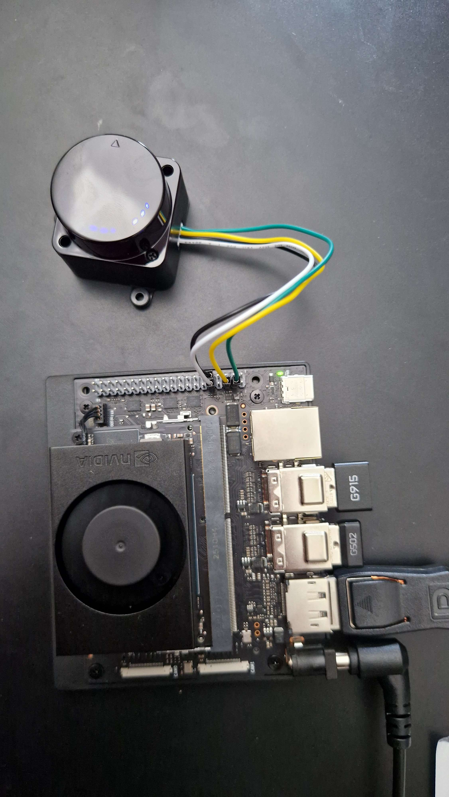

# LD19 LiDAR Setup on Jetson Orin Nano

This guide explains how to set up and use the LD19 LiDAR with the Jetson Orin Nano using ROS2.

## Hardware Setup

### Pin Connections
Connect the LD19 LiDAR to the Jetson's 40-pin header as follows:




1. **LiDAR TX (Pin 1) READ FROM LEFT TO RIGHT** → **Jetson Pin 10 (UART1_RXD)**
   - This is the data output from LiDAR (3.3V logic level)
   - Transmits data at 230400 baud rate

2. **LiDAR PWM (Pin 2)**
   - Can be left disconnected (uses default speed)
   - Or connect to GND for fixed speed

3. **LiDAR GND (Pin 3)** → **Any Jetson GND pin**:
   - Available GND pins on Jetson:
     * Pin 6 (GND)
     * Pin 9 (GND)
     * Pin 14 (GND)
     * Pin 20 (GND)
     * Pin 25 (GND)
     * Pin 30 (GND)
     * Pin 34 (GND)
     * Pin 39 (GND)
   - Use whichever GND pin is most convenient for your wiring

4. **LiDAR 5V (Pin 4)** → **Jetson Pin 2 (5V)**
   - Power supply (4.5V-5.5V)
   - The Jetson's 5V pin can supply up to 1A

### Pin Identification
When holding the LiDAR with the circular part facing upwards, the pins are numbered from left to right (1-4).

## Software Setup

### 1. UART Configuration
Enable the UART port on the Jetson:

```bash
# Disable console on UART
sudo systemctl stop nvgetty
sudo systemctl disable nvgetty
sudo udevadm trigger

# Set permissions
sudo chmod a+rw /dev/ttyTHS1
```

### 2. ROS2 Workspace Setup
```bash
# Create workspace
mkdir -p ~/ldlidar_ros2_ws/src
cd ~/ldlidar_ros2_ws/src

# Clone repository
git clone https://github.com/ldrobotSensorTeam/ldlidar_ros2.git
git submodule update --init --recursive

# Build workspace
cd ~/ldlidar_ros2_ws
colcon build

# Source workspace
source install/local_setup.bash
```

### 3. Launch LiDAR
```bash
ros2 launch ldlidar_ros2 ld19.launch.py
```

## Startup Procedure

1. **Mounting (Most Critical Step)**:
   - Place LiDAR on a solid, flat surface
   - Ensure base is completely stable
   - No part of the LiDAR should be able to move
   - Verify mounting surface is level
   - DO NOT attempt to start without proper mounting

2. **Starting the LiDAR**:
   - Double-check mounting is secure
   - Start the LiDAR node
   - Keep LiDAR stationary
   - Wait 10-15 seconds for full stabilization
   - Do not adjust position during startup

3. **Successful Operation Signs**:
   - Motor spins smoothly
   - No oscillation or jerking
   - Consistent rotation speed
   - Stable scan data output

## Technical Details

### LiDAR Specifications
- **Type**: 2D LiDAR Scanner
- **Technology**: Direct Time-of-Flight (DTOF)
- **Measurement Rate**: Up to 5,000 measurements/second
- **Rotation Speed**: ~130ms per rotation
- **Points per Scan**: ~600 points
- **Range**: 0.02m - 12m
- **Scan Direction**: Counterclockwise
- **Coordinate System**: Left-handed, zero degrees at front
- **Field of View**: 360 degrees

### Data Output
The LiDAR publishes data in two formats:
1. **LaserScan** (`/scan` topic)
   - Traditional 2D laser scan format
   - Used by most 2D SLAM and navigation algorithms
   - More memory efficient

2. **PointCloud2** (`/pointcloud2d` topic)
   - 2D points in 3D space (z=0)
   - Includes intensity values
   - Compatible with 3D visualization tools

### Communication Parameters
- Baud Rate: 230400
- Data Length: 8 bits
- Stop Bit: 1
- Parity: None
- Flow Control: None

### Visualization Options

#### Using RViz2
```bash
ros2 launch ldlidar_ros2 viewer_ld19.launch.py
```
- Shows scan data in 2D
- Red points indicate obstacles
- Updates in real-time

#### Using Foxglove Studio
1. Install Foxglove Bridge:
```bash
sudo apt install ros-humble-foxglove-bridge
```

2. Launch the bridge:
```bash
ros2 launch foxglove_bridge foxglove_bridge_launch.xml
```

3. Open Foxglove Studio and connect to:
   - WebSocket URL: `ws://localhost:8765`
   - View both LaserScan and PointCloud2 data
   - Add interactive markers and visualization tools

## Troubleshooting

### No Data from LiDAR
1. Check physical connections
   - Verify TX → RX connection
   - Check power supply (5V)
   - Ensure GND is connected

2. Verify UART Port
   ```bash
   ls -l /dev/ttyTHS1
   ```

3. Test Raw Data Reception
   ```bash
   stty -F /dev/ttyTHS1 230400 raw
   cat /dev/ttyTHS1 | hexdump -C
   ```
   Should see data starting with "54 2c" (header bytes)

### Permission Issues
```bash
sudo usermod -a -G dialout $USER
sudo chmod a+rw /dev/ttyTHS1
```

### Critical Mounting Requirements

**Important**: The LiDAR requires proper mounting for successful startup and operation.

**Mounting Guidelines:**
1. **Firm Mounting (CRITICAL)**
   - LiDAR MUST be firmly mounted during startup
   - Mount horizontally on a stable, flat surface
   - Secure the base completely - no movement should be possible
   - Do not hand-hold during startup
   - Wait for motor to reach stable speed before adjusting position

2. **Startup Behavior**
   - Initial motor torque is strong
   - Loose mounting will cause startup failure
   - Motor needs stable base to initialize properly
   - Allow 10-15 seconds for full stabilization

3. **Proper Operation**
   - Keep mounted firmly during operation
   - Ensure clear rotation space
   - Monitor for any mounting looseness
   - Re-secure if mounting becomes loose

4. **Intermittent Issues**
   - Sometimes the LiDAR needs multiple power cycles to start properly
   - Give it 10-15 seconds after power-up to stabilize
   - Loose connections can cause intermittent operation
   - If it stops working:
     * Try power cycling
     * Check all connections are firm
     * Let it sit powered for 30 seconds before use

### Power Issues

**Symptoms of Power Problems:**
- Motor rotating back and forth without stabilizing
- Motor stopping after a few oscillations
- Inconsistent or jerky rotation
- Motor not starting at all

**Solutions:**
1. **Direct Power Connection**
   - Use Pin 2 or Pin 4 (5V) directly from Jetson
   - Keep power cable as short as possible
   - Use thicker wires if possible

2. **Voltage Check**
   - Measure voltage at LiDAR end with multimeter
   - Should be at least 4.8V under load
   - Voltage drop indicates insufficient power delivery

3. **Alternative Power Options**
   - Try a separate 5V power supply
   - Use a powered USB hub's 5V output
   - Consider adding a power buffer capacitor (100-470µF)

4. **Connection Quality**
   - Check for loose connections
   - Ensure solid contact in connectors
   - Try re-crimping or soldering connections

The LiDAR needs stable 4.5V-5.5V power supply at about 500mA. Back-and-forth motion is a clear sign of power delivery issues.

## Additional Resources

- [LD19 LiDAR Documentation](https://github.com/ldrobotSensorTeam/ldlidar_ros2)
- [Jetson Orin Nano Pin Documentation](https://docs.nvidia.com/jetson/archives/r35.4.1/DeveloperGuide/text/HR/JetsonOrinNano/PinmuxConfig.html)
- [ROS2 LiDAR Visualization](https://docs.ros.org/en/humble/Tutorials/Beginner-CLI-Tools/Understanding-ROS2-Topics/Understanding-ROS2-Topics.html)

## Notes

1. **Startup Time**: The LiDAR takes 2-3 seconds to start sending data after power-up
2. **Motor Speed**: PWM pin can be left disconnected for default speed
3. **Data Format**: Each packet contains 12 measurement points
4. **Safety**: Always connect/disconnect the LiDAR when the Jetson is powered off